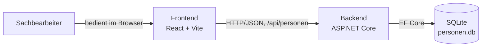
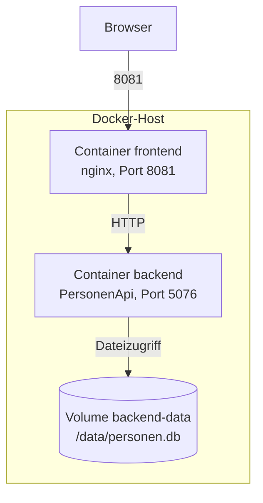
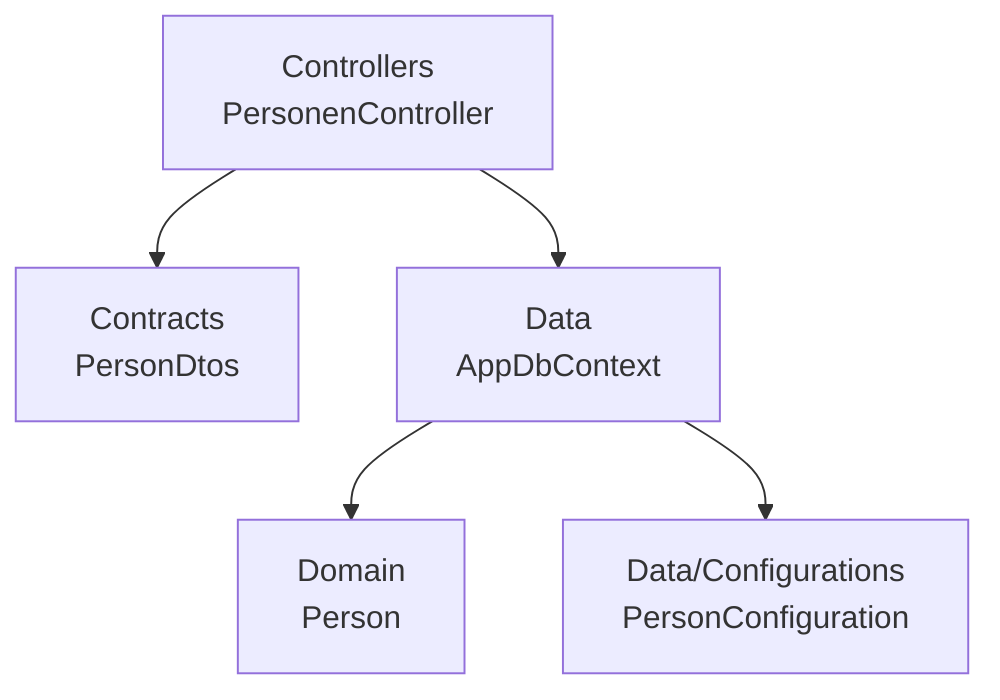
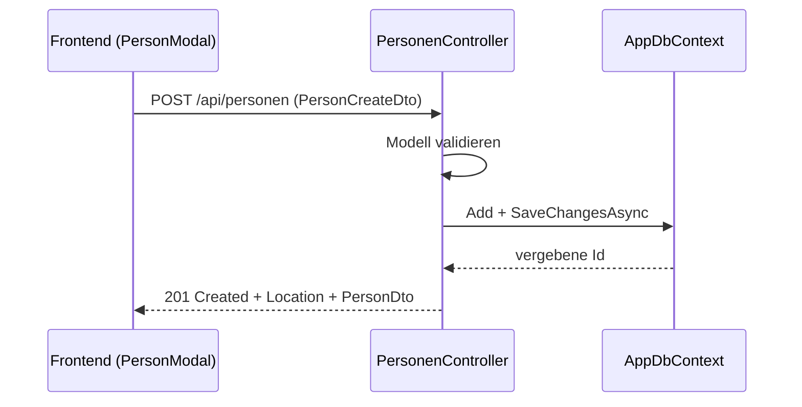
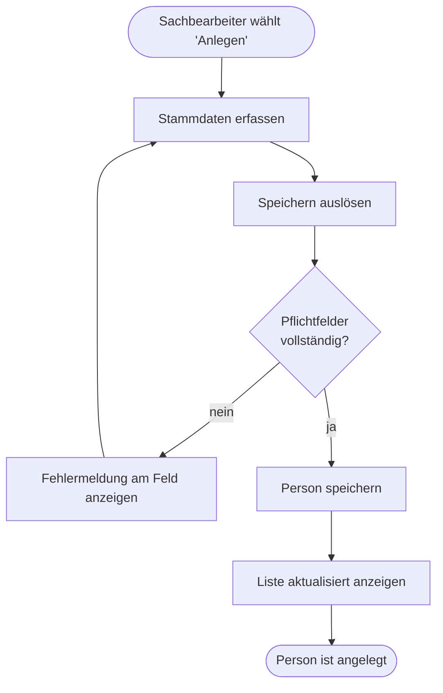

# Entwicklerdokumentations-Konventionen

Regeln, wie die technische Dokumentation dieses Projekts (Architektur, Bausteine, API, Designregeln,
Geschäftsprozesse) geschrieben, strukturiert und aktuell gehalten wird.

> **Geltungsbereich:** alle Dokumente unter `docs/dev/`. Anforderungen (`specs/`), Ideen (`ideas/`)
> und die Endanwender-Dokumentation (`docs/user/`) fallen **nicht** unter diese Datei.
>
> **Regel:** Kein anderes Diagramm-Werkzeug, keine Bilddateien als Diagramme, keine Doku ohne
> aktuellen Code-Bezug. Bei Konflikt zwischen dieser Richtlinie und allgemeinen
> Dokumentations-Instinkten gewinnt die Richtlinie.

---

## 1. Die fünf Grundregeln

| # | Regel | Bedeutung |
|---|---|---|
| 1 | **Zielgruppe Entwickler** | Adressat ist eine Entwicklerin, die neu ins Projekt kommt und den Code noch nicht kennt. Nicht der Endanwender, nicht der Auftraggeber. |
| 2 | **Mermaid** | Einziges Diagramm-Werkzeug. Kein PlantUML, kein draw.io, keine PNG/SVG-Diagramme, keine ASCII-Kästen. |
| 3 | **Am Code belegt** | Jede Aussage ist am aktuellen Stand unter `code/` überprüft. Keine Wunsch-Architektur, keine erfundenen Endpunkte, keine Platzhalter-Doku. |
| 4 | **Synchron mit dem Code** | Eine Code-Änderung, die eine Aussage der Doku ungültig macht, ändert die Doku im **selben** Commit. |
| 5 | **Keine Redundanz zu `specs/`** | `specs/` beschreibt *was* fachlich gilt, `docs/dev/` beschreibt *wie* es gebaut ist. Fachliche Akzeptanzkriterien werden nicht dupliziert, sondern verlinkt. |

Diese fünf Punkte sind nicht verhandelbar.

---

## 2. Ablage und Struktur

```
docs/
├── dev/
│   ├── README.md                    ← Einstiegsseite: Wegweiser + Kurzüberblick
│   ├── 01 Systemarchitektur.md      ← Kontext, Laufzeit, Deployment, Entscheidungen
│   ├── 02 Bausteine.md              ← Bausteinsicht (Building Blocks) je Ebene
│   ├── 03 API.md                    ← HTTP-Schnittstelle: Endpunkte, Formate, Fehler
│   ├── 04 Designregeln.md           ← verbindliche Code- und Architekturregeln
│   └── 05 Geschaeftsprozesse/
│       └── GP{n} {Prozess-Name}.md  ← ein fachlicher Ablauf je Datei
└── user/                            ← Anwender-Doku, nicht Gegenstand dieser Richtlinie
```

- Die fünf Dokumente aus der Tabelle in Abschnitt 3 sind **Pflicht**. Weitere Dateien nur, wenn ein
  Thema in keine davon passt — nicht, um ein zu langes Dokument zu zerteilen.
- **GP** = Geschäftsprozess, laufende Nummer ab 1; Nummern bleiben stabil, neue Prozesse werden
  hinten angehängt.
- `docs/dev/README.md` listet alle Dokumente mit einem Satz Zweck und verlinkt sie. Es ist ein
  Wegweiser, kein Inhaltsspeicher.

### Meta-Block (verbindlich)

Jedes Dokument trägt direkt nach dem H1-Titel:

```
## Meta
- **Stand:** 2026-08-31
- **Bezug:** code/backend/PersonenApi, code/frontend
```

- **Stand** ist das Datum der letzten inhaltlichen Prüfung gegen den Code — absolut, nie relativ.
- **Bezug** nennt die Pfade, gegen die geprüft wurde. Ändert sich dort etwas Strukturelles, ist das
  Dokument fällig.

---

## 3. Die Pflichtdokumente

| Datei | Beantwortet die Frage | Pflicht-Diagramm |
|---|---|---|
| `01 Systemarchitektur.md` | Woraus besteht das System, was läuft wo, warum so? | Kontextdiagramm **und** Deployment-Diagramm |
| `02 Bausteine.md` | Welche Bausteine gibt es innerhalb der Container und wie hängen sie zusammen? | Bausteindiagramm je Ebene |
| `03 API.md` | Wie spricht ein Client mit dem Backend? | Sequenzdiagramm je nicht-trivialem Ablauf |
| `04 Designregeln.md` | Nach welchen Regeln wird hier Code geschrieben? | keins erforderlich |
| `05 Geschaeftsprozesse/GP{n}.md` | Wie läuft ein fachlicher Vorgang durch das System? | Ablaufdiagramm je Prozess (verbindlich) |

---

## 4. Systemarchitektur (`01 Systemarchitektur.md`)

**Zweck:** Der Überblick, den man liest, bevor man irgendetwas anfasst.

Aufbau in dieser Reihenfolge:

1. **Zweck des Systems** — zwei bis drei Sätze, fachlich.
2. **Kontextabgrenzung** — welche Nutzerrollen und Fremdsysteme sprechen mit dem System, über
   welches Protokoll. Als Diagramm plus Tabelle der Nachbarn.
3. **Bausteine auf oberster Ebene** — die laufenden Einheiten (Frontend, Backend, Datenbank) mit
   Technologie und Verantwortung.
4. **Deployment** — welcher Container, welcher Port, welches Volume, welche Umgebungsvariablen.
5. **Querschnittsthemen** — Fehlerbehandlung, CORS, Migrationen, Konfiguration, Logging.
6. **Technische Entscheidungen** — je Entscheidung: Kontext, Entscheidung, Konsequenz, verworfene
   Alternative. Kurz, ein Absatz je Entscheidung.

Kontextdiagramm:



Deployment-Diagramm:



- Ports, Volumes und Umgebungsvariablen werden **aus `docker-compose.yml` übernommen**, nicht aus
  dem Gedächtnis. Weicht die Doku ab, ist die Compose-Datei die Wahrheit.
- Entscheidungen werden mit ihrer Konsequenz dokumentiert, nicht nur mit ihrem Ergebnis.
  ✅ „SQLite, weil Einzelplatzbetrieb; Konsequenz: kein paralleler Schreibzugriff, kein Cluster."
  ❌ „Wir nutzen SQLite."

---

## 5. Bausteine (`02 Bausteine.md`)

**Zweck:** Die Landkarte des Codes — welcher Baustein trägt welche Verantwortung.

- **Ebene 1** = die Container aus Abschnitt 4. **Ebene 2** = die Bausteine innerhalb eines Containers
  (Ordner/Schichten). **Ebene 3** nur für einen Baustein, dessen Innenleben nicht selbsterklärend ist.
- Die Zerlegung endet, wo der Code sich selbst erklärt. Eine Klasse pro Ordner aufzulisten ist keine
  Dokumentation, sondern ein Verzeichnisbaum.
- Jeder Baustein bekommt einen Eintrag in einer Tabelle:

| Baustein | Pfad | Verantwortung | Nutzt |
|---|---|---|---|
| Controllers | `code/backend/PersonenApi/Controllers` | HTTP-Endpunkte, Statuscodes, Validierungsergebnis | Data, Contracts |
| Domain | `code/backend/PersonenApi/Domain` | Entitäten und ihre Invarianten | — |
| Data | `code/backend/PersonenApi/Data` | Persistenz, Mapping, Migrationen | Domain |
| Contracts | `code/backend/PersonenApi/Contracts` | DTOs der HTTP-Schnittstelle | — |



- **Pfeile bedeuten „nutzt", nicht „ruft irgendwann mal auf".** Eine Abhängigkeit, die im Diagramm
  steht, muss im Code existieren; eine, die im Code existiert, darf nicht fehlen.
- Erlaubte und **verbotene** Abhängigkeitsrichtungen werden explizit benannt (z. B. „Domain kennt
  weder Data noch Contracts"). Solche Regeln gehören zusätzlich in `04 Designregeln.md`.

---

## 6. API (`03 API.md`)

**Zweck:** Der Vertrag zwischen Frontend und Backend, lesbar ohne den Backend-Code zu öffnen.

- Quelle der Wahrheit für Feld- und Typangaben sind die DTOs unter `Contracts/` und der Controller —
  nicht die Spec, nicht die Erinnerung.
- Abgrenzung zu `specs/E{n} …/_Backend.md`: Dort steht, **welche** Endpunkte es fachlich gibt und
  warum. Hier steht, **wie** man sie aufruft. Endpunktlisten werden nicht doppelt gepflegt — dieses
  Dokument verlinkt die Spec.

Je Endpunkt in dieser Form:

````markdown
### `GET /api/personen`

Liefert alle Personen in manueller Reihenfolge (`Position` aufsteigend).

**Query-Parameter**

| Name | Typ | Pflicht | Bedeutung |
|---|---|---|---|
| `search` | string | nein | Filtert auf den Namen, Teiltreffer, Groß-/Kleinschreibung egal |

**Antwort `200 OK`**

```json
[{ "id": 1, "name": "Anna Berger", "age": 34 }]
```

**Statuscodes**

| Code | Bedeutung |
|---|---|
| `200` | Liste zurückgegeben, ggf. leer |
| `400` | Ungültige Parameter, Body als `ProblemDetails` |
````

- **Beispiele sind echte Payloads** im tatsächlichen Format (Feldnamen in der Schreibweise, die
  über die Leitung geht), keine Pseudo-JSON-Skizzen.
- Das **Fehlerformat** wird einmal zentral beschrieben (hier: `ProblemDetails`) und danach je
  Endpunkt nur noch referenziert.
- Ein **Sequenzdiagramm** ist Pflicht für jeden Ablauf, der mehr als einen Aufruf umfasst oder
  Zustand ändert:



- Trivialen Einzelaufruf (`GET` einer Liste) **nicht** als Sequenzdiagramm zeichnen.

---

## 7. Designregeln (`04 Designregeln.md`)

**Zweck:** Die Regeln, nach denen neuer Code in diesem Projekt aussehen muss.

> **Abgrenzung — was wo steht:**
> - Visuelles Design (Farben, Typografie, Komponenten, Copy): **ausschließlich** [`_uiux.md`](_uiux.md).
> - Verbindliche Backend-Architektur- und Bausteinvorgaben (Entitäten, DTOs, EF-Konfigurationen,
>   Controller, Statuscodes, Migrationen): **ausschließlich** [`_design.md`](_design.md).
> - C#-Codestil (Namensgebung, Formatierung, ReSharper-Konventionen): **ausschließlich**
>   [`_code.md`](_code.md).
>
> `04 Designregeln.md` wiederholt keine dieser Quellen, sondern **verlinkt** sie und ergänzt, was
> dort nicht geregelt ist — insbesondere die Frontend-Regeln (Zustand, API-Zugriff, Typisierung,
> Styling-Nutzung) und die Herleitung der Regeln aus dem tatsächlichen Code.

**Vorrang bei Widerspruch:** `_design.md` und `_code.md` sind **Vorgabe** (Soll), `04 Designregeln.md`
ist **Beschreibung** (Ist). Weicht der Code von den Harness-Vorgaben ab, wird die Abweichung im
Abschnitt „Bewusste Abweichungen" benannt — sie wird nicht stillschweigend als Regel dokumentiert.

Themen, die abgedeckt sein müssen:

- **Schichten und Abhängigkeitsrichtung** — wer darf wen kennen, was ist verboten.
- **Domain vs. DTO** — Entitäten verlassen die API nie direkt; Mapping-Ort ist festgelegt.
- **Fehlerbehandlung** — wo Fehler entstehen, wie sie nach außen abgebildet werden.
- **Validierung** — Backend ist autoritativ (siehe [`_requirements.md`](_requirements.md)).
- **Namenskonventionen** — Dateien, Typen, Endpunkte, Feldnamen, Testids.
- **Frontend-Zustand** — wo Zustand lebt, welche Komponenten Daten laden, was reine Darstellung ist.
- **Asynchronität und Nullability** — `async`/`await`-Durchgängigkeit, `strict`/Nullable aktiviert.

Jede Regel folgt genau diesem Muster: **Regel — Begründung — Beispielpaar.**

```markdown
### Entitäten verlassen den Controller nie

**Regel:** Ein Controller gibt ausschließlich Typen aus `Contracts/` zurück.
**Warum:** Sonst wird jedes Persistenzfeld Teil des öffentlichen Vertrags; eine Spaltenumbenennung
bricht dann das Frontend.

- ✅ `return Ok(person.ToDto());`
- ❌ `return Ok(person);`
```

- **Keine Regel ohne Begründung.** Eine Regel, deren „Warum" niemand kennt, wird beim ersten
  Zeitdruck gebrochen.
- **Keine Regel ohne Gegenbeispiel.** Das ❌-Beispiel zeigt den Fehler, der tatsächlich passiert.
- Regeln sind Ist-Stand des Projekts. Was noch nicht gilt, gehört nach `ideas/`, nicht hierher.

---

## 8. Geschäftsprozesse (`05 Geschaeftsprozesse/GP{n} ….md`)

**Zweck:** Fachliche Abläufe end-to-end — vom Auslöser bis zum Ergebnis, über alle Beteiligten hinweg.

Aufbau je Datei:

```markdown
# GP{n} {Prozess-Name}

## Meta
- **Stand:** 2026-08-31
- **Bezug:** specs/E1 Personenverwaltung/F2 Personenpflege

## Ziel
Ein Satz: welches fachliche Ergebnis der Prozess herstellt.

## Auslöser
Was den Prozess startet (Nutzeraktion, Zeitpunkt, eingehendes Ereignis).

## Beteiligte
| Rolle / System | Beitrag |

## Ablauf
{Mermaid-Diagramm}

## Schritte
| # | Schritt | Verantwortlich | Ergebnis |

## Ausnahmen
| Fall | Verhalten |
```



- **Fachsprache, nicht Codesprache.** Im Ablaufdiagramm stehen fachliche Schritte
  („Person speichern"), keine Methodennamen, keine Klassen, keine HTTP-Verben.
- **Jeder Prozess hat einen benannten Start- und Endknoten** (`([…])`), jede Entscheidungsraute
  hat beschriftete Kanten (`-- ja -->` / `-- nein -->`).
- **Fehlerpfade gehören ins Diagramm**, nicht nur in den Fließtext. Ein Prozess ohne Ausnahmefall
  ist meist unvollständig gedacht.
- Ein Prozess, der mehrere Beteiligte über die Zeit koordiniert, wird als `sequenceDiagram`
  gezeichnet; ein Prozess mit Verzweigungen als `flowchart`.

---

## 9. Mermaid-Konventionen (verbindlich)

**Motivation:** Diagramme, die im Repository versioniert, im Diff lesbar und ohne Werkzeug
änderbar sind. Ein exportiertes Bild erfüllt keinen dieser Punkte.

| Zweck | Diagrammtyp |
|---|---|
| Kontext, Container, Deployment | `graph TB` / `graph LR` mit `subgraph` |
| Bausteine und ihre Abhängigkeiten | `graph TD` |
| Aufrufabläufe zwischen Komponenten | `sequenceDiagram` |
| Fachlicher Ablauf mit Verzweigungen | `flowchart TD` |
| Datenmodell | `erDiagram` |
| Statuslebenszyklus einer Entität | `stateDiagram-v2` |

Regeln:

- Diagramme stehen als ```` ```mermaid ````-Block **im Markdown**, nie als Datei-Anhang.
- **Kein Diagramm ohne Einleitungssatz.** Über jedem Diagramm steht ein Satz, was es zeigt und was
  daraus zu lesen ist. Ein Diagramm allein ist kein Argument.
- **Beschriftungen deutsch**, Bezeichner aus dem Code in Originalschreibweise
  (`PersonenController`, `FK_TrainerId`).
- **Kanten werden beschriftet**, wenn die Beziehung nicht offensichtlich ist
  (`-->|"HTTP/JSON"|`). Entscheidungskanten immer.
- **Höchstens ca. 15 Knoten pro Diagramm.** Wird es größer, ist es die falsche Abstraktionsebene —
  aufteilen, nicht verkleinern.
- **Keine Farben, kein `classDef`, keine Emojis** — außer zur Hervorhebung genau eines Elements
  mit begründetem Anlass.
- Label mit Sonderzeichen (`(`, `,`, `:`) in Anführungszeichen setzen: `A["Frontend (nginx)"]`.
  Zeilenumbruch mit `<br/>`.
- Jedes Diagramm wird **einmal gerendert geprüft**, bevor es committet wird. Ein Diagramm mit
  Syntaxfehler ist schlimmer als keins.

---

## 10. Pflege und Synchronität

Die Doku wird zusammen mit dem Code geändert — nicht „später aufgeräumt".

| Änderung im Projekt | Fällige Doku |
|---|---|
| Neuer/geänderter Endpunkt, neues DTO-Feld | `03 API.md` |
| Neuer Ordner, neue Schicht, neue Abhängigkeit | `02 Bausteine.md` |
| Neuer Container, Port, Volume, Umgebungsvariable | `01 Systemarchitektur.md` |
| Neue verbindliche Code- oder Backend-Designvorgabe | `harness/_code.md` bzw. `harness/_design.md` — **nicht** `04 Designregeln.md` |
| Code folgt einer Harness-Vorgabe nachweislich nicht | Abschnitt „Bewusste Abweichungen" in `04 Designregeln.md` |
| Neuer oder geänderter fachlicher Ablauf | `05 Geschaeftsprozesse/` |
| Story wechselt auf `State: Implemented` | betroffene Dokumente prüfen, `Stand` aktualisieren |

- Reine Refactorings ohne Struktur- oder Vertragsänderung erfordern **keine** Doku-Änderung.
- Wer ein Dokument anfasst, aktualisiert dessen `Stand` — auch bei kleinen Korrekturen.
- **Kein Platzhalter-Inhalt.** Ein Abschnitt „TBD" wird nicht committet; entweder er wird gefüllt
  oder er entsteht später vollständig.
- Widerspricht die Doku dem Code, gilt der Code als Wahrheit und die Doku wird korrigiert — der
  Widerspruch wird beim Korrigieren benannt, nicht stillschweigend überschrieben.

---

## 11. Sprache und Form

- **Deutsch**, sachlich, Präsens, Aktiv. Der Ton entspricht [`_uiux.md`](_uiux.md), Abschnitt 2:
  keine Ausrufezeichen, keine Superlative, keine Werbesprache.
- **Bezeichner in Backticks** und in Originalschreibweise: `PersonenController`, `POST /api/personen`,
  `docker-compose.yml`, `ConnectionStrings__DefaultConnection`.
- **Absolute Datums- und Versionsangaben**, nie „letzte Woche", „aktuell", „demnächst".
- Aufzählung vor Fließtext, Tabelle vor Aufzählung, wenn es mehr als zwei Attribute je Eintrag gibt.
- **Keine Emojis** außer den ✅/❌-Markern in Beispielpaaren.
- Interne Verweise als relative Markdown-Links (`[Bausteine](02%20Bausteine.md)`), damit sie im
  Repository klickbar bleiben.

---

## 12. Anti-Patterns (nicht tun)

- Diagramme als PNG/SVG einchecken oder mit PlantUML, draw.io oder ASCII-Kästen zeichnen.
- Ein Diagramm ohne erklärenden Satz einfügen — oder umgekehrt einen Ablauf nur im Fließtext
  beschreiben, für den ein Ablaufdiagramm vorgeschrieben ist.
- Akzeptanzkriterien aus `specs/` in die Entwicklerdoku kopieren.
- Endpunktlisten parallel in `03 API.md` und `_Backend.md` pflegen.
- Ordnerbäume oder Klassenlisten als „Bausteinsicht" ausgeben.
- Architektur dokumentieren, die so noch nicht gebaut ist (das gehört nach `ideas/`).
- Designregeln ohne Begründung oder ohne Gegenbeispiel aufschreiben.
- Visuelle Gestaltungsregeln in `04 Designregeln.md` duplizieren, statt `_uiux.md` zu verlinken.
- Vorgaben aus `_design.md` oder `_code.md` in `04 Designregeln.md` abschreiben, statt sie zu verlinken.
- Eine Abweichung des Codes von `_design.md`/`_code.md` als Designregel dokumentieren, statt sie als
  Abweichung zu benennen.
- Den `Stand` unverändert lassen, obwohl der Inhalt geändert wurde.
- Diagramme mit 40 Knoten, in denen die eigentliche Aussage untergeht.
- „TBD"-Abschnitte, leere Gliederungen oder auskommentierte Entwürfe committen.
